# Dash Streamer

<br />

## Gabriel Soares

<br />
<br />

#### **Disciplina:** Sistemas Gráficos e Multimídia

#### **Prof.:** Tiago Maritan

---

# **D**ynamic **A**daptive **S**treaming over **H**TTP

<div class="grid grid-cols-[1fr_2fr] gap-4">

<div>

<div class="bg-blue-50 dark:bg-blue-900/30 px-4 pt-1 pb-4 rounded-lg">

**🎯 Conceitos Principais:**

- **Segmentação**: Vídeo dividido em pequenos segmentos (2-10s)
- **Múltiplas Qualidades**: Cada segmento em diferentes resoluções/bitrates
- **Adaptação Dinâmica**: Player ajusta qualidade automaticamente de acordo com a largura de banda

</div>

</div>

<div>

<div class="py-3 rounded-lg">

<h4 class="text-sm font-semibold text-gray-800 dark:text-gray-200 text-center">Adaptação Dinâmica de Qualidade</h4>

<svg height="300" viewBox="0 0 560 300">
  <!-- Quality level labels with bitrates -->
  <text x="15" y="65" class="text-xs fill-gray-700 dark:fill-gray-300 font-medium" >2160p (35 Mbps)</text>
  <text x="15" y="105" class="text-xs fill-gray-700 dark:fill-gray-300 font-medium">1440p (16 Mbps)</text>
  <text x="15" y="145" class="text-xs fill-gray-700 dark:fill-gray-300 font-medium">1080p (8 Mbps)</text>
  <text x="15" y="185" class="text-xs fill-gray-700 dark:fill-gray-300 font-medium"> 720p (5 Mbps)</text>
  <text x="15" y="225" class="text-xs fill-gray-700 dark:fill-gray-300 font-medium"> 480p (2.5 Mbps)</text>
  <text x="15" y="265" class="text-xs fill-gray-700 dark:fill-gray-300 font-medium">  360p (1 Mbps)</text>
  
  <!-- Segment grid (9 segments x 6 quality levels) -->
  <!-- 4K segments -->
  <rect x="110" y="45" width="44" height="28" fill="#3b82f6" opacity="0.3" stroke="#3b82f6" stroke-width="0.5"/>
  <rect x="157" y="45" width="44" height="28" fill="#3b82f6" opacity="0.3" stroke="#3b82f6" stroke-width="0.5"/>
  <rect x="204" y="45" width="44" height="28" fill="#3b82f6" opacity="0.3" stroke="#3b82f6" stroke-width="0.5"/>
  <rect x="251" y="45" width="44" height="28" fill="#3b82f6" opacity="0.3" stroke="#3b82f6" stroke-width="0.5"/>
  <rect x="298" y="45" width="44" height="28" fill="#3b82f6" opacity="0.3" stroke="#3b82f6" stroke-width="0.5"/>
  <rect x="345" y="45" width="44" height="28" fill="#3b82f6" opacity="0.3" stroke="#3b82f6" stroke-width="0.5"/>
  <rect x="392" y="45" width="44" height="28" fill="#3b82f6" opacity="0.3" stroke="#3b82f6" stroke-width="0.5"/>
  <rect x="439" y="45" width="44" height="28" fill="#3b82f6" opacity="0.3" stroke="#3b82f6" stroke-width="0.5"/>
  <rect x="486" y="45" width="44" height="28" fill="#3b82f6" opacity="0.3" stroke="#3b82f6" stroke-width="0.5"/>
  
  <!-- 1440p segments -->
  <rect x="110" y="85" width="44" height="28" fill="#6366f1" opacity="0.3" stroke="#6366f1" stroke-width="0.5"/>
  <rect x="157" y="85" width="44" height="28" fill="#6366f1" opacity="0.3" stroke="#6366f1" stroke-width="0.5"/>
  <rect x="204" y="85" width="44" height="28" fill="#6366f1" opacity="0.3" stroke="#6366f1" stroke-width="0.5"/>
  <rect x="251" y="85" width="44" height="28" fill="#6366f1" opacity="0.3" stroke="#6366f1" stroke-width="0.5"/>
  <rect x="298" y="85" width="44" height="28" fill="#6366f1" opacity="0.3" stroke="#6366f1" stroke-width="0.5"/>
  <rect x="345" y="85" width="44" height="28" fill="#6366f1" opacity="0.3" stroke="#6366f1" stroke-width="0.5"/>
  <rect x="392" y="85" width="44" height="28" fill="#6366f1" opacity="0.3" stroke="#6366f1" stroke-width="0.5"/>
  <rect x="439" y="85" width="44" height="28" fill="#6366f1" opacity="0.3" stroke="#6366f1" stroke-width="0.5"/>
  <rect x="486" y="85" width="44" height="28" fill="#6366f1" opacity="0.3" stroke="#6366f1" stroke-width="0.5"/>
  
  <!-- 1080p segments -->
  <rect x="110" y="125" width="44" height="28" fill="#10b981" opacity="0.3" stroke="#10b981" stroke-width="0.5"/>
  <rect x="157" y="125" width="44" height="28" fill="#10b981" opacity="0.3" stroke="#10b981" stroke-width="0.5"/>
  <rect x="204" y="125" width="44" height="28" fill="#10b981" opacity="0.3" stroke="#10b981" stroke-width="0.5"/>
  <rect x="251" y="125" width="44" height="28" fill="#10b981" opacity="0.3" stroke="#10b981" stroke-width="0.5"/>
  <rect x="298" y="125" width="44" height="28" fill="#10b981" opacity="0.3" stroke="#10b981" stroke-width="0.5"/>
  <rect x="345" y="125" width="44" height="28" fill="#10b981" opacity="0.3" stroke="#10b981" stroke-width="0.5"/>
  <rect x="392" y="125" width="44" height="28" fill="#10b981" opacity="0.3" stroke="#10b981" stroke-width="0.5"/>
  <rect x="439" y="125" width="44" height="28" fill="#10b981" opacity="0.3" stroke="#10b981" stroke-width="0.5"/>
  <rect x="486" y="125" width="44" height="28" fill="#10b981" opacity="0.3" stroke="#10b981" stroke-width="0.5"/>
  
  <!-- 720p segments -->
  <rect x="110" y="165" width="44" height="28" fill="#f59e0b" opacity="0.3" stroke="#f59e0b" stroke-width="0.5"/>
  <rect x="157" y="165" width="44" height="28" fill="#f59e0b" opacity="0.3" stroke="#f59e0b" stroke-width="0.5"/>
  <rect x="204" y="165" width="44" height="28" fill="#f59e0b" opacity="0.3" stroke="#f59e0b" stroke-width="0.5"/>
  <rect x="251" y="165" width="44" height="28" fill="#f59e0b" opacity="0.3" stroke="#f59e0b" stroke-width="0.5"/>
  <rect x="298" y="165" width="44" height="28" fill="#f59e0b" opacity="0.3" stroke="#f59e0b" stroke-width="0.5"/>
  <rect x="345" y="165" width="44" height="28" fill="#f59e0b" opacity="0.3" stroke="#f59e0b" stroke-width="0.5"/>
  <rect x="392" y="165" width="44" height="28" fill="#f59e0b" opacity="0.3" stroke="#f59e0b" stroke-width="0.5"/>
  <rect x="439" y="165" width="44" height="28" fill="#f59e0b" opacity="0.3" stroke="#f59e0b" stroke-width="0.5"/>
  <rect x="486" y="165" width="44" height="28" fill="#f59e0b" opacity="0.3" stroke="#f59e0b" stroke-width="0.5"/>
  
  <!-- 480p segments -->
  <rect x="110" y="205" width="44" height="28" fill="#ef4444" opacity="0.3" stroke="#ef4444" stroke-width="0.5"/>
  <rect x="157" y="205" width="44" height="28" fill="#ef4444" opacity="0.3" stroke="#ef4444" stroke-width="0.5"/>
  <rect x="204" y="205" width="44" height="28" fill="#ef4444" opacity="0.3" stroke="#ef4444" stroke-width="0.5"/>
  <rect x="251" y="205" width="44" height="28" fill="#ef4444" opacity="0.3" stroke="#ef4444" stroke-width="0.5"/>
  <rect x="298" y="205" width="44" height="28" fill="#ef4444" opacity="0.3" stroke="#ef4444" stroke-width="0.5"/>
  <rect x="345" y="205" width="44" height="28" fill="#ef4444" opacity="0.3" stroke="#ef4444" stroke-width="0.5"/>
  <rect x="392" y="205" width="44" height="28" fill="#ef4444" opacity="0.3" stroke="#ef4444" stroke-width="0.5"/>
  <rect x="439" y="205" width="44" height="28" fill="#ef4444" opacity="0.3" stroke="#ef4444" stroke-width="0.5"/>
  <rect x="486" y="205" width="44" height="28" fill="#ef4444" opacity="0.3" stroke="#ef4444" stroke-width="0.5"/>
  
  <!-- 360p segments -->
  <rect x="110" y="245" width="44" height="28" fill="#dc2626" opacity="0.3" stroke="#dc2626" stroke-width="0.5"/>
  <rect x="157" y="245" width="44" height="28" fill="#dc2626" opacity="0.3" stroke="#dc2626" stroke-width="0.5"/>
  <rect x="204" y="245" width="44" height="28" fill="#dc2626" opacity="0.3" stroke="#dc2626" stroke-width="0.5"/>
  <rect x="251" y="245" width="44" height="28" fill="#dc2626" opacity="0.3" stroke="#dc2626" stroke-width="0.5"/>
  <rect x="298" y="245" width="44" height="28" fill="#dc2626" opacity="0.3" stroke="#dc2626" stroke-width="0.5"/>
  <rect x="345" y="245" width="44" height="28" fill="#dc2626" opacity="0.3" stroke="#dc2626" stroke-width="0.5"/>
  <rect x="392" y="245" width="44" height="28" fill="#dc2626" opacity="0.3" stroke="#dc2626" stroke-width="0.5"/>
  <rect x="439" y="245" width="44" height="28" fill="#dc2626" opacity="0.3" stroke="#dc2626" stroke-width="0.5"/>
  <rect x="486" y="245" width="44" height="28" fill="#dc2626" opacity="0.3" stroke="#dc2626" stroke-width="0.5"/>
  
  <!-- Active segments (highlighted to show what's being played) -->
  <rect x="110" y="125" width="44" height="28" fill="#10b981" opacity="0.8" stroke="#10b981" stroke-width="1"/>
  <rect x="157" y="165" width="44" height="28" fill="#f59e0b" opacity="0.8" stroke="#f59e0b" stroke-width="1"/>
  <rect x="204" y="205" width="44" height="28" fill="#ef4444" opacity="0.8" stroke="#ef4444" stroke-width="1"/>
  <rect x="251" y="205" width="44" height="28" fill="#ef4444" opacity="0.8" stroke="#ef4444" stroke-width="1"/>
  <rect x="298" y="165" width="44" height="28" fill="#f59e0b" opacity="0.8" stroke="#f59e0b" stroke-width="1"/>
  <rect x="345" y="125" width="44" height="28" fill="#10b981" opacity="0.8" stroke="#10b981" stroke-width="1"/>
  <rect x="392" y="125" width="44" height="28" fill="#10b981" opacity="0.8" stroke="#10b981" stroke-width="1"/>
  <rect x="439" y="85" width="44" height="28" fill="#6366f1" opacity="0.8" stroke="#6366f1" stroke-width="1"/>
  <rect x="486" y="45" width="44" height="28" fill="#3b82f6" opacity="0.8" stroke="#3b82f6" stroke-width="1"/>
  
  <!-- Adaptation path (smooth curve showing quality played over time) -->
  <path d="M 132 139 Q 170 150 179 179 Q 220 219 243 219 Q 265 219 320 179 Q 350 139 414 139 Q 440 139 461 99 Q 480 59 508 59" 
        stroke="#374151" stroke-width="3" fill="none" opacity="1" class="stroke-gray-700 dark:stroke-gray-300"/>
  
  <!-- Timeline -->
  <line x1="110" y1="285" x2="530" y2="285" stroke="#9ca3af" stroke-width="1"/>
  <text x="132" y="300" class="text-xs fill-gray-600 dark:fill-gray-400 text-anchor-middle">6s</text>
  <text x="179" y="300" class="text-xs fill-gray-600 dark:fill-gray-400 text-anchor-middle">12s</text>
  <text x="226" y="300" class="text-xs fill-gray-600 dark:fill-gray-400 text-anchor-middle">18s</text>
  <text x="273" y="300" class="text-xs fill-gray-600 dark:fill-gray-400 text-anchor-middle">24s</text>
  <text x="320" y="300" class="text-xs fill-gray-600 dark:fill-gray-400 text-anchor-middle">30s</text>
  <text x="367" y="300" class="text-xs fill-gray-600 dark:fill-gray-400 text-anchor-middle">36s</text>
  <text x="414" y="300" class="text-xs fill-gray-600 dark:fill-gray-400 text-anchor-middle">42s</text>
  <text x="461" y="300" class="text-xs fill-gray-600 dark:fill-gray-400 text-anchor-middle">48s</text>
  <text x="508" y="300" class="text-xs fill-gray-600 dark:fill-gray-400 text-anchor-middle">54s</text>
</svg>

</div>


</div>

</div>

---

# Módulos

<div class="flex justify-center w-auto mx-auto mt-20">
  <div class="bg-yellow-50 dark:bg-yellow-900/30 p-6 rounded-xl shadow-lg border border-yellow-400 dark:border-yellow-500 w-64 flex items-center flex-col justify-between">
    <div class="text-3xl mb-4 text-center">🎬</div>
    <h3 class="text-xl font-bold text-yellow-800 dark:text-yellow-200 mb-4 text-center">Processamento de Video</h3>
    <div class="flex items-center gap-2 mt-2">
      
      <span class="text-sm text-yellow-700 dark:text-yellow-300 font-medium">Python</span>
    </div>
  </div>

  <svg class="relative z-10" width="120" height="200" viewBox="0 0 120 200">
  <defs>
    <marker id="arrowhead-right" markerWidth="8" markerHeight="6" refX="8" refY="3" orient="auto">
      <polygon points="0 0, 8 3, 0 6" fill="#9ca3af" opacity="0.7" />
    </marker>
  </defs>
  
  <!-- Top arrow: Processing → Server -->
  <line x1="15" y1="130" x2="105" y2="130" stroke="#9ca3af" stroke-width="1.5" opacity="0.6" stroke-dasharray="4,2" marker-end="url(#arrowhead-right)" />
  <text x="60" y="60" text-anchor="middle" class="text-xs fill-gray-400 font-normal">Video Data</text>
  <line x1="105" y1="70" x2="15" y2="70" stroke="#9ca3af" stroke-width="1.5" opacity="0.6" stroke-dasharray="4,2" marker-end="url(#arrowhead-right)" />
  <text x="60" y="150" text-anchor="middle" class="text-xs fill-gray-400 font-normal">Arquivos Dash</text>
  </svg>

  <div class="bg-blue-50 dark:bg-blue-900/30 p-6 rounded-xl shadow-lg border border-blue-400 dark:border-blue-500 w-64 flex items-center flex-col justify-between">
    <div class="text-3xl mb-4 text-center">🖥️</div>
    <h3 class="text-xl font-bold text-blue-800 dark:text-blue-200 mb-4 text-center">Servidor de Conteúdo</h3>
    <div class="flex items-center gap-2 mt-2">
      
      <span class="text-sm text-blue-700 dark:text-blue-300 font-medium">Flask</span>
    </div>
  </div>

  <svg class="relative z-10" width="120" height="200" viewBox="0 0 120 200">
  <!-- Top arrow: Server → Client -->
  <line x1="15" y1="130" x2="105" y2="130" stroke="#9ca3af" stroke-width="1.5" opacity="0.6" stroke-dasharray="4,2" marker-end="url(#arrowhead-right)" />
  <text x="60" y="60" text-anchor="middle" class="text-xs fill-gray-400 font-normal">Upload Video</text>
  
  <line x1="105" y1="70" x2="15" y2="70" stroke="#9ca3af" stroke-width="1.5" opacity="0.6" stroke-dasharray="4,2" marker-end="url(#arrowhead-right)" />
  <text x="60" y="150" text-anchor="middle" class="text-xs fill-gray-400 font-normal">Video Streaming</text>
  </svg>

  <div class="bg-green-50 dark:bg-green-900/30 p-6 rounded-xl shadow-lg border border-green-400 dark:border-green-500 w-64 flex items-center flex-col justify-between">
    <div>
    <div class="text-3xl mb-4 text-center">💻</div>
    <h3 class="text-xl font-bold text-green-700 dark:text-green-300 mb-4 text-center">Cliente</h3>
    </div>
    <div class="flex items-center gap-2 mt-2">
      
      <span class="text-sm text-green-600 dark:text-green-400 font-medium">Vue.js</span>
    </div>
  </div>
</div>

---

# Pipeline de Processamento

```mermaid {theme: 'base'}
flowchart LR
    A[🔍 Análise] --> B[🧹 Preprocessamento]
    B --> C[🖼️ Thumbnail]
    C --> D[⚙️ Representações]
    D --> E[📦 Segmentação DASH]
    
    style A fill:#fff3e0,stroke:#333,color:#000
    style B fill:#e8f5e8,stroke:#333,color:#000
    style C fill:#e1f5fe,stroke:#333,color:#000
    style D fill:#ffebee,stroke:#333,color:#000
    style E fill:#f3e5f5,stroke:#333,color:#000
```

<div class="light:block dark:hidden">



</div>

<div class="hidden dark:block">



</div>

<div class="mt-8 grid grid-cols-2 gap-8 text-sm">

<div>

```mermaid {theme: 'dark'}
flowchart LR
    A[🔍 Análise] --> B[🧹 Preprocessamento]
    B --> C[🖼️ Thumbnail]
    C --> D[⚙️ Representações]
    D --> E[📦 Segmentação DASH]
    
    style A fill:#2d3748,stroke:#e2e8f0,color:#fff
    style B fill:#2f855a,stroke:#e2e8f0,color:#fff
    style C fill:#2b6cb0,stroke:#e2e8f0,color:#fff
    style D fill:#c53030,stroke:#e2e8f0,color:#fff
    style E fill:#805ad5,stroke:#e2e8f0,color:#fff
```

**🔍 Análise**

- Detecção de streams (vídeo/áudio/metadata)
- Propriedades físicas vs. exibição
- Rotação e aspect ratio

**🧹 Preprocessamento**

- Limpeza streams problemáticos (mebx)
- Preservação metadados essenciais
- Stream copy para performance

</div>

<div>

**⚙️ Representações**

- Ladders adaptativos (portrait/landscape)
- Dimensões pares para codecs
- Bitrates otimizados por qualidade

**📦 Segmentação DASH**

- H.264, segmentos 4s
- Conflict handling para rotações
- MPD + init/chunk segments

</div>

</div>

---

# Exemplo: Preprocessamento de Vídeo iPhone

<div class="grid grid-cols-2 gap-20">

<div class="justify-center mt-12">

<div class="light:block dark:hidden">


</div>

<div class="hidden dark:block">



</div>

<div class="mt-8">

```mermaid {theme: 'dark'}
flowchart TD
    A["🔍 FFprobe<br/>7 streams"] --> B["📹 Video<br/>1920×1080, -90°"]
    A --> C["🔊 Audio<br/>Stereo"]
    A --> D["⚠️ 5× mebx<br/>Metadata"]
    
    B --> E["✅ Limpo<br/>1080×1920"]
    C --> E
    D --> F["❌ Removidos"]
    
    style A fill:#2b6cb0,stroke:#e2e8f0,color:#fff
    style B fill:#d69e2e,stroke:#e2e8f0,color:#fff
    style C fill:#d69e2e,stroke:#e2e8f0,color:#fff
    style D fill:#c53030,stroke:#e2e8f0,color:#fff
    style F fill:#c53030,stroke:#e2e8f0,color:#fff
    style E fill:#2f855a,stroke:#e2e8f0,color:#fff
```

##### Ferramentas utilizadas:
<div class="flex items-start gap-3 text-sm">

<div class="text-sm">
<div class="mb-1"><strong>FFprobe</strong> - Análise de streams</div>
<div><strong>FFmpeg</strong> - Limpeza e preprocessamento</div>
</div>
</div>
</div>
</div>

<div>

  <div class="flex items-center gap-4 mb-4">
  <div class="bg-gray-100 dark:bg-gray-800 p-2 rounded" style="width: 176px; height: 99px;">
  
  </div>
  <div class="text-xs">
  <strong>🎥 Codificado</strong> - 1920×1080<br/>
  <span class="text-red-600">Display Matrix: -90°</span>
  </div>
  </div>

  <div class="flex items-center gap-4 mb-4">
  <div class="bg-gray-100 dark:bg-gray-800 p-2 rounded" style="width: 99px; height: 176px;">
  
  </div>
  <div class="text-xs">
  <strong>✅ Correto</strong> - 1080×1920<br/>
  <span class="text-green-600">Portrait adequado</span>
  </div>
  </div>

  <div class="flex items-center gap-4">
  <div class="bg-gray-100 dark:bg-gray-800 p-2 rounded" style="width: 176px; height: 99px;">
  
  </div>
  <div class="text-xs">
  <strong>❌ Antes</strong> - 1920x1080<br/>
  <span class="text-red-600">Esticado horizontalmente</span>
  </div>
  </div>

</div>

</div>


---

# Cálculo de Representações de Vídeo

<div class="grid grid-cols-[auto_1fr] gap-8 mt-6">

<div class="mt-8">

### Fatores Considerados

- **📊 Resolução máxima** da fonte
- **📐 Aspect Ratio** do vídeo original
- **🔄 Orientação** (Paisagem ou Retrato)
- **🎯 Targets adaptativos** por orientação

</div>

<div class="text-sm leading-tight bg-gray-50 dark:bg-gray-800 p-2 rounded-lg">

| **Qualidade** | **Bitrate** | **Paisagem 16:9** | **Retrato 9:16** |
|:----------|---------------:|:-------------:|:---------------:|
| 2160p (4K) | 35 Mbps | 3840×2160 | 2160×3840 |
| 1440p (2K) | 16 Mbps | 2560×1440 | 1440×2560 |
| 1080p (FHD) | 8 Mbps | 1920×1080 | 1080×1920 |
| 720p (HD) | 5 Mbps | 1280×720 | 720×1280 |
| 480p (SD) | 2.5 Mbps | 854×480 | 480×854 |
| 360p | 1 Mbps | 640×360 | 360×640 |
| 240p | 700 Kbps | 426×240 | 240×426 |
| 144p | 340 Kbps | 256×144 | 144×256 |

</div>

</div>

---

# Geração dos segmentos e MPD

<div class="grid grid-cols-[1fr_2fr] gap-12">

<div>

##### Lib utilizada:
<div class="flex items-center gap-1 text-sm mb-4">

<div class="text-sm">python_ffmpeg_video_streaming</div>
</div>

#### Arquivos gerados:

<div class="bg-gray-50 dark:bg-gray-800 p-2 rounded-lg">

```bash
video_folder/
├── manifest.mpd     # Manifest
├── thumbnail.jpg    # Preview
├── info.json        # Metadata
├── init_0.m4s       # Video init
├── init_1.m4s       
├── init_2.m4s       # Audio init
├── chunk_0_001.m4s  # Rep.1 segments
├── chunk_0_002.m4s  
...
├── chunk_1_001.m4s  # Rep.2 segments
├── chunk_1_002.m4s  
...
├── chunk_2_001.m4s  # Audio segments
├── chunk_2_002.m4s  # Audio segments
...
```

</div>

</div>

<div>

<style>
.mpd-example pre,
.mpd-example code {
  line-height: 1.35 !important;
}
</style>

<div class="mpd-example">

```xml
<MPD mediaPresentationDuration="PT2M34.0S">
  <AdaptationSet id="0" contentType="video">
    <Representation id="0" bandwidth="16384000"
                    width="2560" height="1440">
				<SegmentTemplate duration="4000000"
              initialization="init_$RepresentationID$.m4s"
              media="chunk_$RepresentationID$_$Number%03d$.m4s" />
			</Representation>
      <Representation id="1" bandwidth="8192000"
                    width="1920" height="1080">
				<SegmentTemplate duration="4000000"
              initialization="init_$RepresentationID$.m4s"
              media="chunk_$RepresentationID$_$Number%03d$.m4s" />
			</Representation>
      ...
  </AdaptationSet>

  <AdaptationSet id="1" contentType="audio">
			<Representation id="2" bandwidth="128000">
				<SegmentTemplate duration="4000000"
                initialization="init_$RepresentationID$.m4s"
                media="chunk_$RepresentationID$_$Number%03d$.m4s" />
			</Representation>
  </AdaptationSet>
</MPD>
```

</div>

</div>

</div>

<!--
Segmentos de 4 segundos
-->

---

# Servidor

<div class="absolute top-10 right-16 flex items-center gap-3">

<span class="text-lg font-medium text-gray-600 dark:text-gray-400">Flask</span>
</div>

<div class="bg-gray-50 dark:bg-gray-800 p-2 rounded-lg">

| Método | Endpoint | Descrição |
|--------|----------|---------|
| **POST** | `/videos` | Upload |
| **GET** | `/videos` | Lista de vídeos |
| **GET** | `/videos/<id>/info.json` | Metadados do vídeo |
| **GET** | `/videos/<id>/manifest.mpd` | Manifesto DASH |
| **GET** | `/videos/<id>/<file>` | Segmentos |

</div>

